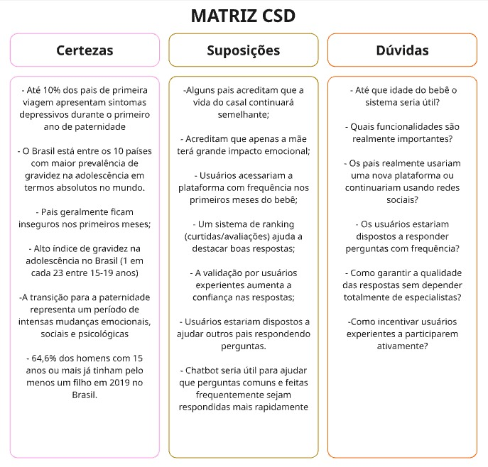
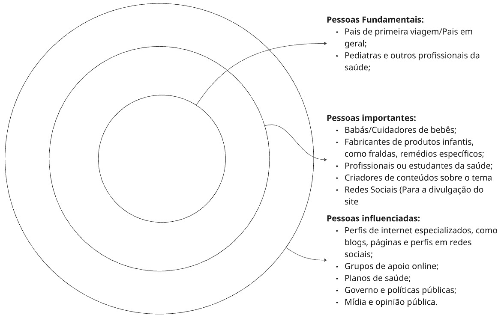
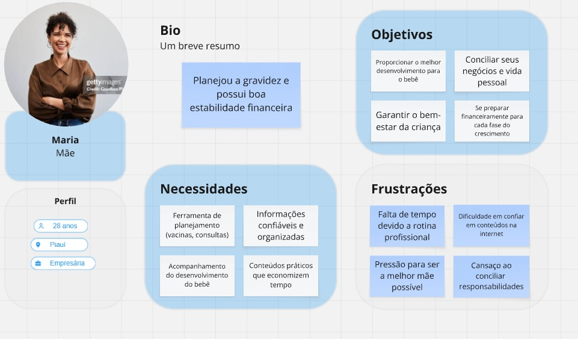
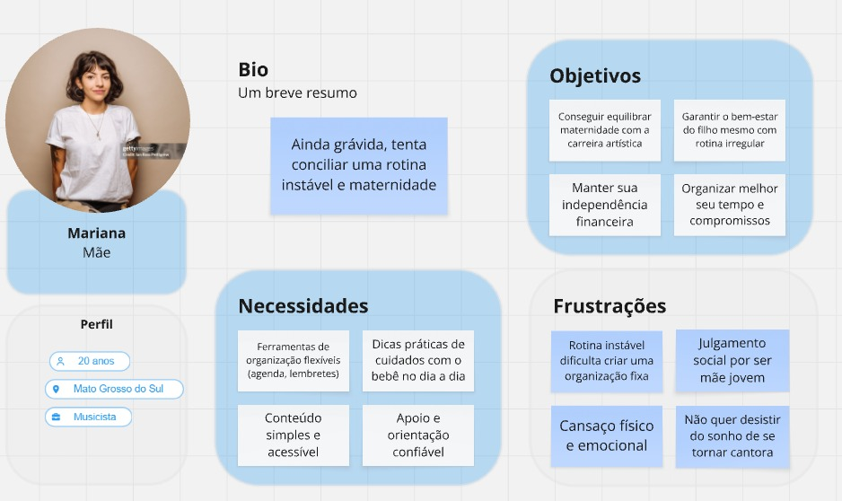
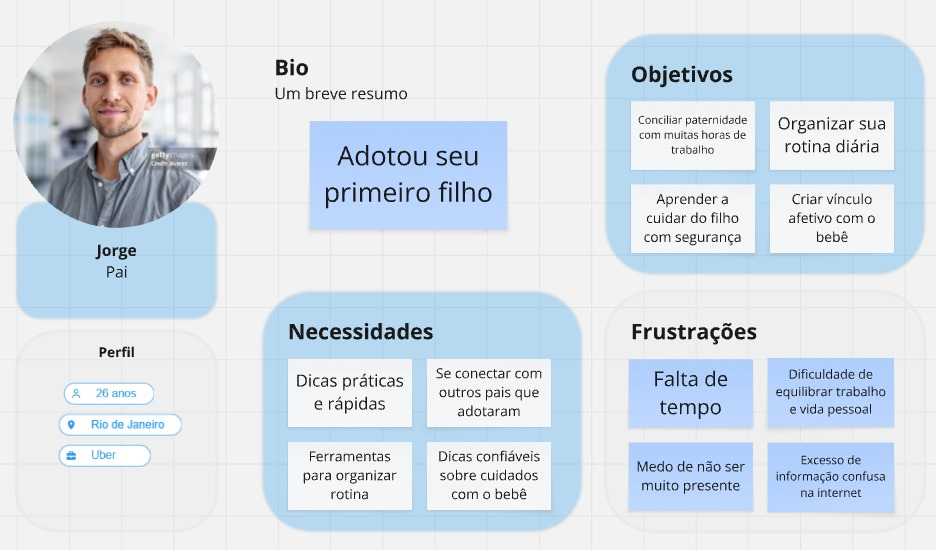
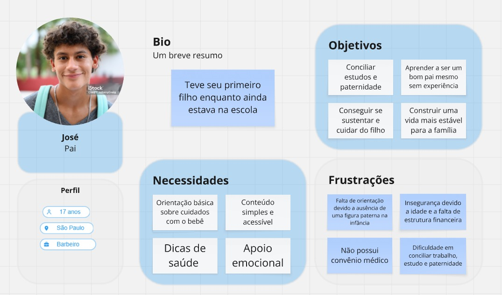
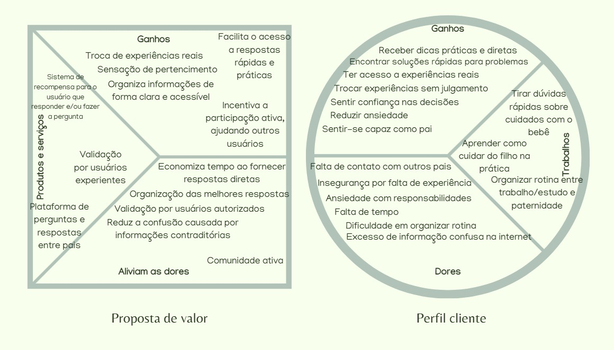
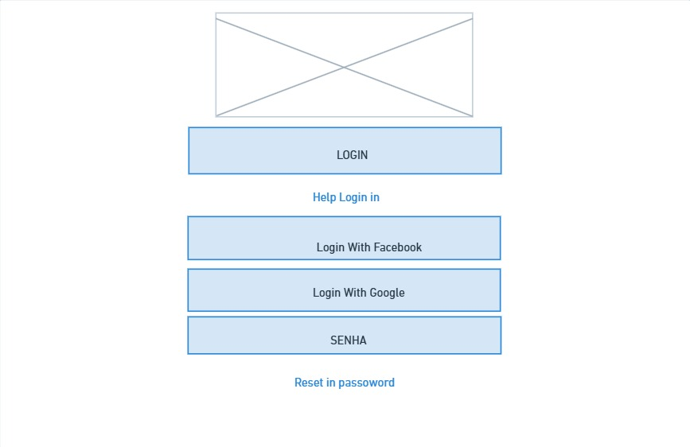
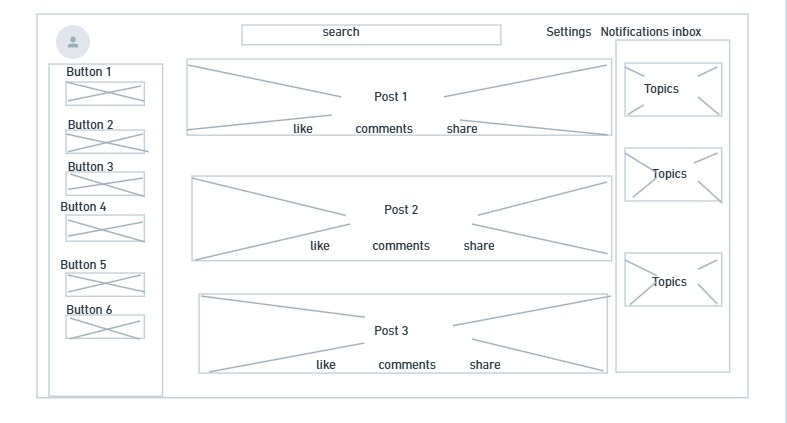
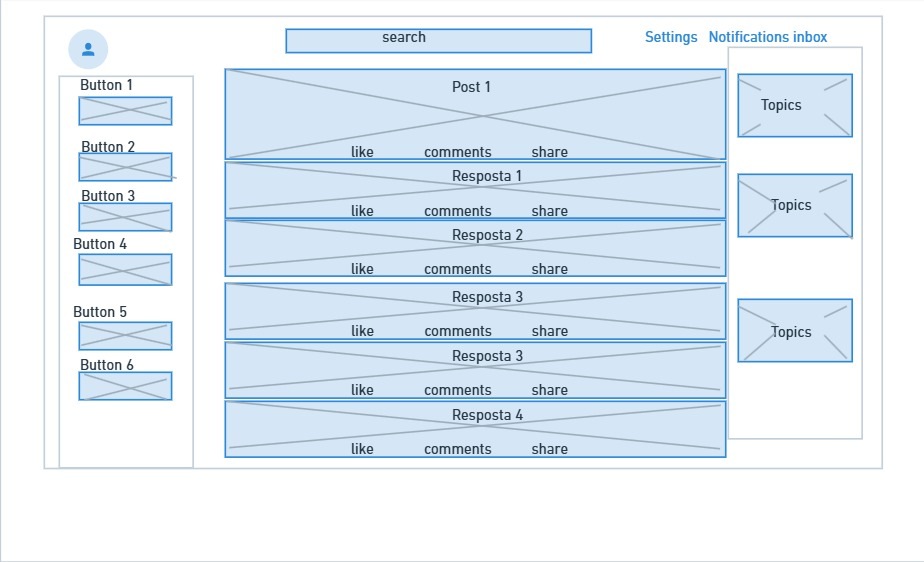

# Guia de pais de primeira viagem - PôPai

> Uma plataforma colaborativa voltada para pais de primeira viagem que enfrentam dúvidas e desafios na criação de seu bebê. Inspirada em modelos como fóruns e comunidades interativas (reddit, brainly...),
> a aplicação permite compartilhar experiências, fazer perguntas e encontrar apoio de outros pais que possam ajudar, tudo isso de maneira gamificada, com sistema de ofensivas, por exemplo. Assim como no brainly,
> a ideia é validar algumas respostas por meio de estudantes de medicina, médicos, enfermeiros, etc.

Repositório no GitHub: https://github.com/T0RR35/PoPai---G7

## Membros do Grupo

**Daniel Costa Alves da Cunha**  
**Felipe Custodio de Souza**  
**Gabriel Oliveira Alves**  
**Isaque Eduardo Gonçalves de Paiva**  
**Gabriel Vinícius Soares Doti**  
**Rafael Ferreira Torres Modesto**  
**Rodrigo Ventura Teixeira**

---

## Contexto do Projeto

### Problema

Pais de primeira viagem frequentemente enfrentam dúvidas e desafios na criação de seu bebê e à adaptação à rotina familiar. A falta de experiência, a insegurança pode gerar dúvidas constantes e dificuldades na 
tomada de decisão.

Atualmente, embora existam diversas fontes de informação (sites, vídeos, redes sociais, etc), a ideia é criar uma aplicação que possa ajudar a sanar problemas de maneira mais prática, com troca de experiências 
reais entre os usuários, desde problemas como dificuldades com amamentação rotina de sono do bebê, cólicas e alimentação, até questões relacionadas ao desenvolvimento infantil, adaptação dos pais à nova rotina 
e desafios emocionais da paternidade.

- Contexto: busca por orientação e troca de experiências entre pais de primeira viagem  
- Onde ocorre: ambiente digital (internet, redes sociais, fóruns) e cotidiano familiar  
- Impactos do problema:
  - Insegurança na tomada de decisões
  - Dificuldade em encontrar informações confiáveis
  - Sensação de isolamento ao lidar com desafios da paternidade
  - Sobrecarga de informações desconexas
    
---

### Objetivo do Projeto

#### Objetivo Geral
Desenvolver um software capaz de solucionar o problema apresentado.

#### Objetivos Específicos

- Organizar o conteúdo gerado pelos usuários (como em ferramentas de busca), facilitando a busca por informações relevantes  
- Criar um ambiente seguro e acolhedor para que os usuários se sintam confortáveis em expor dúvidas e dificuldades  
- Implementar mecanismos de avaliação (curtidas, respostas mais úteis, etc) para destacar conteúdos mais relevantes  
- Validar respostas com estudantes de medicina, médicos, enfermeiros, etc
- Gamificação para maior engajamento por parte dos usuários

---

### Justificativa

A transição para a paternidade representa um período de intensas mudanças emocionais, sociais e psicológicas. Estudos indicam que até 10% dos pais de primeira viagem apresentam sintomas depressivos durante o 
primeiro ano após o nascimento do filho, evidenciando que esse momento pode ser acompanhado de inseguranças, ansiedade e dificuldades de adaptação. (ver referências)

Além disso, muitos pais enfrentam desafios práticos no cuidado com o bebê e na organização da rotina, frequentemente recorrendo a informações dispersas na internet. A ausência de um espaço estruturado para 
troca de experiências reais pode intensificar a sensação de isolamento e dificultar a resolução de problemas cotidianos.

Diante desse cenário, torna-se relevante o desenvolvimento de uma solução que promova apoio mútuo entre pais, permitindo o compartilhamento de vivências e a construção coletiva de conhecimento prático. A 
escolha por aprofundar aspectos como interação entre usuários e organização de conteúdo se justifica pela necessidade de tornar a informação mais acessível e aplicável à realidade dos usuários.

---

### Público-Alvo

A solução é direcionada principalmente a pais de primeira viagem, que enfrentam desafios iniciais no cuidado com o bebê e na adaptação à nova rotina. Esses usuários geralmente possuem diferentes níveis 
de conhecimento, mas compartilham a necessidade de orientação prática e troca de experiências reais.

- Tipo de usuário:
  - Pais de primeira viagem
  - Pais em geral que buscam apoio e troca de experiências
  - Famílias que necessitam de orientação no cuidado com bebês  

- Conhecimento técnico:
  - Básico a intermediário no uso de tecnologia (smartphones, redes sociais, aplicativos)
  - Pouca experiência prática com cuidados infantis  

- Relação com tecnologia:
  - Usuários ativos em redes sociais e plataformas digitais
  - Familiaridade com consumo de conteúdo online

- Contexto de uso:
  - Ambiente doméstico, durante a rotina com o bebê
  - Situações de dúvida ou necessidade de apoio
  - Momentos de busca por experiências reais e conselhos práticos  

- Relações e influência:
  - Interagem direta ou indiretamente com profissionais da saúde (como pediatras)
  - Podem ser influenciados por criadores de conteúdo, comunidades online e redes sociais
  - Também incluem cuidadores e familiares que auxiliam na criação da criança  

Além do público principal, a plataforma também pode atrair usuários secundários, como cuidadores, estudantes da área da saúde e criadores de conteúdo, que contribuem com informações e experiências, 
enriquecendo o ecossistema da aplicação.

---

## Processo de Product Discovery

### Matriz CSD (Certezas, Suposições e Dúvidas)

 

---

### Mapa de Stakeholders

 

---

### Pesquisa e Entendimento do Problema

Para compreender melhor o contexto enfrentado por pais de primeira viagem, foram realizadas pesquisas em diferentes fontes, com o objetivo de identificar as principais dificuldades, comportamentos 
e necessidades desse público.

- Fontes utilizadas:
  - Artigos científicos e dados estatísticos sobre paternidade e saúde mental  
  - Conteúdos em blogs, fóruns e redes sociais voltados para pais e maternidade/paternidade  
  - Vídeos e relatos de experiências reais compartilhados online  

- Observações gerais:
  - Grande volume de dúvidas recorrentes relacionadas a cuidados básicos com o bebê  
  - Dificuldade em encontrar informações centralizadas e confiáveis  
  - Forte presença de relatos pessoais em comunidades online, indicando a importância da troca de experiências  

- Principais problemas identificados:
  - Insegurança na tomada de decisões no dia a dia  
  - Excesso de informações dispersas e, muitas vezes, contraditórias  
  - Falta de apoio emocional e sensação de isolamento  
  - Dificuldade em encontrar respostas rápidas e aplicáveis à realidade  

- Comportamento dos usuários:
  - Buscam respostas rápidas, geralmente por meio de pesquisas na internet  
  - Valorizam experiências reais de outras pessoas mais do que conteúdos puramente teóricos  
  - Tendem a participar de comunidades online para tirar dúvidas e compartilhar vivências  

- Possíveis métodos complementares (a serem realizados):
  - Aplicação de questionários com pais de primeira viagem  
  - Entrevistas com usuários do público-alvo  
  - Análise de interações em comunidades online  

---

### Personas

#### Persona 1
 

#### Persona 2
 

#### Persona 3
 

#### Persona 4
 

---

## Processo de Product Design

### Histórias de Usuário

#### Usuário padrão: Pais, mães, qualquer pessoa que queira ver ou fazer/responder perguntas no site.
- Como usuário padrão, quero fazer perguntas sobre minha situação com meu filho para obter ajuda e orientação de outras pessoas
- Como usuário padrão, quero responder perguntas para ajudar outras pessoas e evoluir no sistema gamificado
- Como usuário padrão, quero pesquisar dúvidas já respondidas para encontrar respostas rapidamente sem precisar perguntar novamente
- Como usuário padrão, quero curtir ou avaliar respostas para ajudar a destacar as mais úteis
- como usuário padrão, quero receber notificações quando minha pergunta for respondida para acompanhar as interações

#### Usuário experiente: Pessoas com poder de verificar perguntas e respostas feitas pelos usuários padrões (pediatras, por exemplo)
- Como usuário experiente, quero validar ou corrigir respostas feitas por usuários para garantir maior confiabilidade das informações
- Como usuário experiente, quero adicionar informações às respostas existentes para torná-las mais completas e claras

#### Usuário administrador: Pessoa com acesso a alterar o site por completo, podendo excluir perguntas, remover usuários, ou qualquer coisa que o “dono” do site poderia fazer.
- Como administrador, quero excluir perguntas ou respostas inadequadas para garantir um ambiente saudável
- Como administrador, quero remover ou bloquear usuários para garantir um ambiente saudável

---

### Proposta de Valor

 

---

## Projeto de Interface

### Fluxo do Usuário

---

### Wireframes

Inclua imagens ou links:

 
 
 

---

### Protótipo Interativo

[Acessar Protótipo](https://whimsical.com/2YDbVZseRvkSyxxdjstCin)

---

## Metodologia

### Ferramentas

- **VS Code**  
  Utilizado como editor de código principal, devido à sua leveza e suporte a múltiplas linguagens.

- **GitHub**  
  Plataforma de versionamento de código, permitindo o controle de versões, colaboração entre os membros da equipe e organização do projeto.

- **Discord**  
  Utilizado para comunicação entre os membros da equipe

- **WhatsApp**  
  Ferramenta complementar de comunicação, utilizada para trocas rápidas de mensagens e avisos informais.

- **Whimsical**  
  Utilizado para a criação de fluxos de usuário, wireframes e organização visual de ideias

- **Miro**  
  Ferramenta de colaboração visual utilizada para construção de mapas como o de stakeholders, matriz csd e organização de informações durante o processo de discovery.

---

### Organização da Equipe e Papéis

- **Metodologia:** Scrum  

- **Divisão em equipes:**  
  O grupo foi dividido em duas duplas e um trio, sendo que cada equipe ficou responsável por uma parte do desenvolvimento do projeto. Essa divisão permitiu maior foco nas tarefas, ao mesmo
  tempo em que manteve a colaboração ativa entre todos os membros por meio de trocas constantes de ideias.

- **Papéis no Scrum:**
  - **Product Owner:** Daniel Costa e Felipe Custódio (responsáveis por definir prioridades e requisitos do produto)  
  - **Scrum Master:** Gabriel Vinícius, Gabriel Oliveira e Rodrigo Ventura (responsáveis por garantir o bom andamento do processo e remover impedimentos)  
  - **Time de Desenvolvimento:** Rafael Ferreira e Isaque Eduardo (responsáveis pela implementação das funcionalidades e entregas do projeto)  

---

### 📋 Quadro Kanban

O gerenciamento das tarefas do projeto foi realizado por meio de um quadro Kanban, permitindo a visualização do progresso das atividades e a organização do fluxo de trabalho da equipe.

- **Estrutura do quadro:**
  - **To Do (A Fazer):** implementação do sistema (começo do código e testes) 
  - **Doing (Em Andamento):** pequenos ajustes na matriz CSD e mapa de stakeholders conforme solicitado pelo professor
  - **Done (Concluído):** definição de problema, personas, requisitos iniciais, design e organização

---

## Referências Bibliográficas

- TOIVO, Jessica et al. First-time parents’ bonding with their baby: A longitudinal study on Finnish parents during the first eight months of parenthood. Children (Basel, Switzerland), v. 10, n. 11, p. 1806, 2023.
